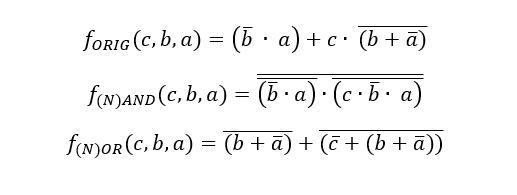
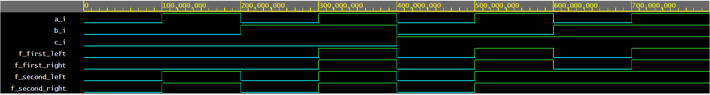

# Lab 1: Patrik Škeřík  ID: 240982

### De Morgan's laws

1. Equations of all three versions of logic function f(c,b,a):

   

2. Listing of VHDL architecture from design file (`design.vhd`) for all three functions. Always use syntax highlighting, meaningful comments, and follow VHDL guidelines:

```vhdl
architecture dataflow of gates is
begin
    f_orig_o <= (not(b_i) and a_i) or (c_i and not(b_i or not(a_i)));
    f_nand_o <= not(not(not(b_i) and a_i) and not(c_i and not(b_i) and a_i));
    f_nor_o  <= not(b_i or not(a_i)) or not(not(c_i) or (b_i or not(a_i)));
end architecture dataflow;
```

3. Complete table with logic functions' values:

   | **c** | **b** |**a** | **f_ORIG** | **f_(N)AND** | **f_(N)OR** |
   | :-: | :-: | :-: | :-: | :-: | :-: |
   | 0 | 0 | 0 | 0 | 0 | 0 |
   | 0 | 0 | 1 | 1 | 1 | 1 |
   | 0 | 1 | 0 | 0 | 0 | 0 |
   | 0 | 1 | 1 | 0 | 0 | 0 |
   | 1 | 0 | 0 | 0 | 0 | 0 |
   | 1 | 0 | 1 | 1 | 1 | 1 |
   | 1 | 1 | 0 | 0 | 0 | 0 |
   | 1 | 1 | 1 | 0 | 0 | 0 |

### Distributive laws

1. Screenshot with simulated time waveforms. Always display all inputs and outputs (display the inputs at the top of the image, the outputs below them) at the appropriate time scale!

   

```vhdl
architecture dataflow of gates is
begin
    f_first_left <= (a_i and b_i) or (a_i and c_i);   -- first distribution law left side
    f_first_right <= a_i and (b_i or c_i); 	      -- first distribution law right side
    f_second_left  <= (a_i or b_i) and (a_i or c_i);  -- second distribution law left side
    f_second_right  <= a_i or (b_i and c_i);  	      -- second distribution law right side
end architecture dataflow;
```

2. Link to your public EDA Playground example:

   [https://www.edaplayground.com/x/j2Ci](https://www.edaplayground.com/x/j2Ci)
