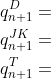

 

**D-type FF**
   | **clk** | **d** | **q(n)** | **q(n+1)** | **Comments** |
   | :-: | :-: | :-: | :-: | :-- |
   |  | 0 | 0 | 0 | `q(n+1)` has the same level as `d` |
   |  | 0 | 1 | 0 |  |
   |  | 1 |  | 1 |  |
   |  | 1 |  | 1 |  |

   **JK-type FF**
   | **clk** | **j** | **k** | **q(n)** | **q(n+1)** | **Comments** |
   | :-: | :-: | :-: | :-: | :-: | :-- |
   |  | 0 | 0 | 0 | 0 | Output did not change |
   |  | 0 | 0 | 1 | 1 | Output did not change |
   |  | 0 |  |  |  |  |
   |  | 0 |  |  |  |  |
   |  | 1 |  |  |  |  |
   |  | 1 |  |  |  |  |
   |  | 1 |  |  |  |  |
   |  | 1 |  |  |  |  |

   **T-type FF**
   | **clk** | **t** | **q(n)** | **q(n+1)** | **Comments** |
   | :-: | :-: | :-: | :-: | :-- |
   |  | 0 | 0 | 0 | Output did not change |
   |  | 0 | 1 |  |  |
   |  | 1 |  |  |  |
   |  | 1 |  |  |  |
