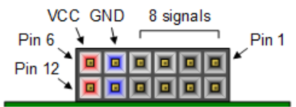
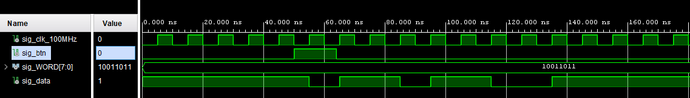
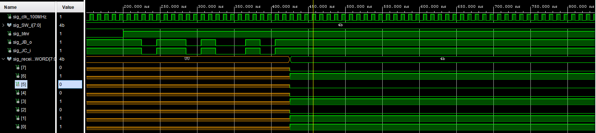
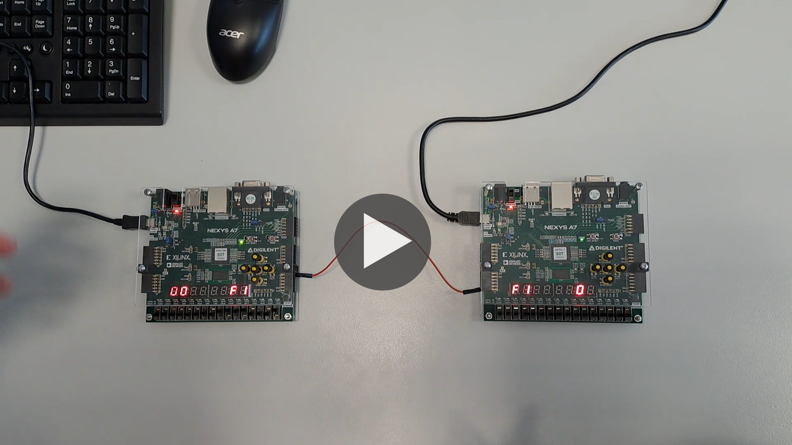

# UAMT

### Team members

* Mykyta Syskov (Coding, logic)
* Patrik Škeřík (Research, coding, manager)
* Zdeněk Trtík (Research, logic)

### Table of contents

* [Project objectives](#objectives)
* [Hardware description](#hardware)
* [VHDL modules description and simulations](#modules)
* [TOP module description and simulations](#top)
* [Video](#video)
* [References](#references)

## Project objectives

Code UART for nexys A7 50T and be able to send a message from one device and be able to read it on another. 

## Hardware description

[see References 3, 4](#references)  

used:  
PMOD ports JC(1) as input, JB(1) as output  

4 digits of a 7 segment display  
Switches 0-7  
CLK100MHZ  

## VHDL modules description and simulations

driver_7seg_4digits  
clock_enable  
cnt_up_down  
hex_7seg  

RX (receiver)
 

TX (transmitter)
 

## TOP module description and simulations

## Video

## References

1. [driver_7seg_4digits](https://github.com/skerikpa/digital-electronics-1/tree/main/07-display_driver)
2. [UART wikipedia](https://en.wikipedia.org/wiki/Universal_asynchronous_receiver-transmitter)
3. [Nexys A7 50T schematic](https://github.com/tomas-fryza/digital-electronics-1/blob/master/docs/nexys-a7-sch.pdf)
4. [Nexys A7 50T reference manual](https://digilent.com/reference/programmable-logic/nexys-a7/reference-manual?redirect=1)
