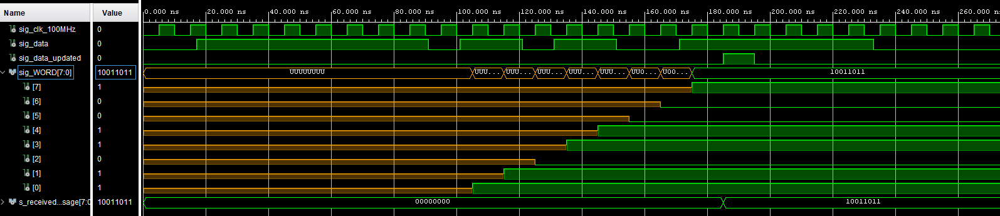

# UAMT

### Team members

* Mykyta Syskov (Coding, logic)
* Patrik Škeřík (Research, coding)
* Zdeněk Trtík (Research, logic)

### Table of contents

* [Project objectives](#objectives)
* [Hardware description](#hardware)
* [VHDL modules description and simulations](#modules)
* [TOP module description and simulations](#top)
* [Video](#video)
* [References](#references)

## Project objectives

Code UART for nexys A7 50T and be able to send a message from one device and be able to read it on another. 

## Hardware description

Write your text here.

## VHDL modules description and simulations

driver_7seg_4digits  
clock_enable  
cnt_up_down  
hex_7seg  

RX (receiver)
 

TX (transmitter)
 

## TOP module description and simulations

## Video

Write your text here

## References

1. Write your text here.
